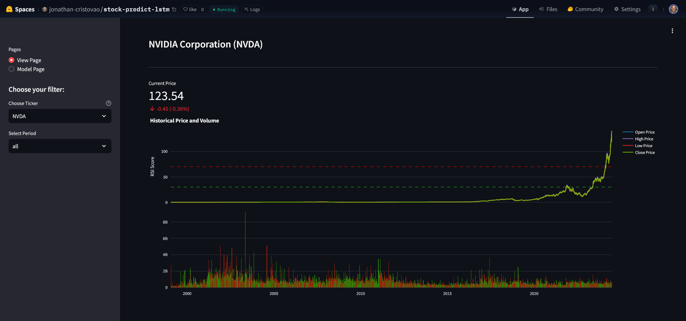
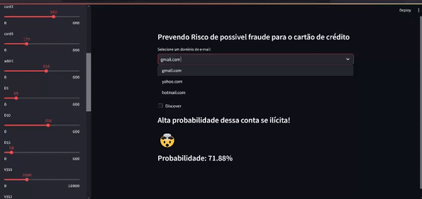

### Data Science portfolio

       

  

#### Jonathan Cristovão F da Silva
 Data Scientist 

Este portfólio apresenta uma variedade de projetos que destacam minhas habilidades em ciência de dados, incluindo análises estatísticas aprofundadas, preparação eficiente e visualização de dados, além da utilização de técnicas avançadas de deep learning e machine learning para modelagem preditiva. Como especialista em big data, aplico essas competências na gestão de grandes volumes de dados, garantindo insights precisos e acionáveis. Este portfólio reflete minhas competências e realizações como cientista de dados e doutorando em Ciência da Computação na Universidade Federal de Ouro Preto (UFOP), onde continuo a me especializar na criação de algoritmos de IA inovadores para projetos complexos de ciência de dados.

*  
* Email: jonathancristovao13@gmail.com   

**Soft skills:** Criatividade, Proatividade, Disciplina, pensamento critico, comunicação, organização e colaboração.

**Hard skills:** Python, C++, C#, SQL, Azure , Power BI, Tableau, Machine Learning, Deep Learning, LLMs.

## Projetos:

------------

<table>
  <tr>
    <td width="10%">
        <h3>Análise e previsão das Ações da NVIDIA - Finances</h3>
        
<a href="https://github.com/JonathanCristovao/financial-analytics/tree/main/Investments/stock-predict">Código</a>

        
<a href="https://huggingface.co/spaces/jonathan-cristovao/real-time-stock-forecasting">Visualização Web</a>

        
Exploração e visualização dos dados financeiros das ações da NVIDIA.

        
por <a href="https://github.com/JonathanCristovao">@JonathanCristovao</a>

    </td>
    <td width="30%">
        
        </a>
    </td>
  </tr>
</table>

------------

<table>
  <tr>
    <td width="30%">
        Credit Card Transactions</a></h3>
<a href="https://github.com/JonathanCristovao/financial-analytics/tree/main/Fraud_analysis/transaction_fraud_detection">Code</a>

A web application designed to identify fraudulent activity in credit card transactions using machine learning techniques.

by <a href="https://github.com/JonathanCristovao">@JonathanCristovao</a>

    </td>
    <td width="60%">
        
    </td>
  </tr>
</table>

------------

[Clusterização de consumidores por uso de energia elétrica](https://github.com/JonathanCristovao/clustering-consumers) Aplicação de técnicas de clusterização para segmentação de clientes baseado no consumo de energia.

## Deep learning 

[Price prediction BitCoin - Finance](https://github.com/JonathanCristovao/Bitcoin-Historical-Data-RNN-LSTM) Modelos de RNN e LSTM para previsão de preços de criptomoedas.

[Detect diseases in oranges - Agriculture](https://github.com/JonathanCristovao/Multi-class-image-classification-mobilenet) Classificação de imagens para diagnóstico de doenças agrícolas em laranjas.

## Computer vision

[Image classification with Machine Learning](https://github.com/JonathanCristovao/Bootcamp-Unimed-BH-Ciencia-de-Dados-DiO/tree/main/machine-learning) Implementação de algoritmos de aprendizado de máquina para classificação de imagens.

## Engineering and requirements engineering

[HAR com LSTM](https://github.com/JonathanCristovao/Human-Activity-Recognition-HAR-LSTM) Reconhecimento de atividades humanas usando redes LSTM.

[HAR com (LSTM, GRU, and Simple RNN)](https://github.com/JonathanCristovao/LSTM_GRU_RNN_human-activity-recognition) Aplicação de diferentes arquiteturas de redes neurais para reconhecimento de atividades humanas.

## Natural language process
(Coming soon) 

